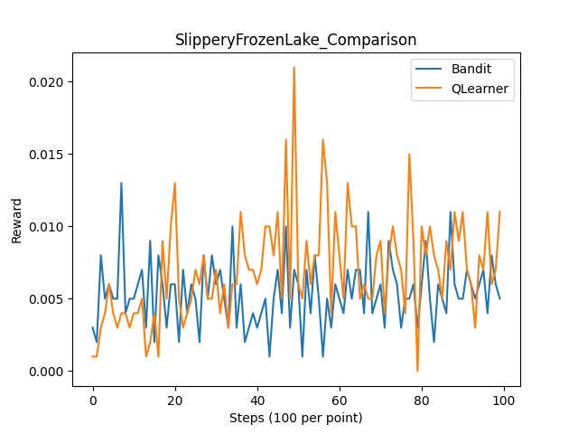
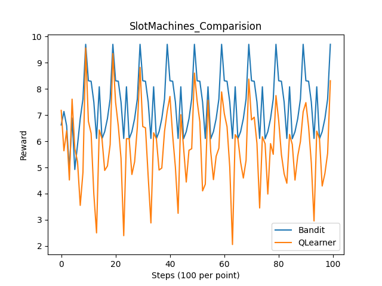

# Homework 4 written answer
## Q2.

In this plot we can see that Q Learner have a higher reward per step. Both algorithm reached the most optimal run before step 20. MAB got to that most optimal solution faster.

In this plot we can see on average Q learner received higher rewards. Q leaner reach the reward peak at around 50 steps. MAB on the other Stayed pretty consistent. This seem to imply that Q learner found the best solution where as MAB got stuck.

In this plot we can see that on average Bandit performed better than the Q learner.  Both algorithm followed the same type of trend but MAB consistantly get higher rewards while Q learner's reward hovers at a lower level.

b.

FrozenLake and slipperyFrozenLake are the two plot where Q learner appears to receive a higher average reward.

This can be explained by the fact that Q learning consider state transitions and are more suitable for complex environment. MAB assumes that the action of the agent does not impact the environment and subsequent reward, which makes it less suitable for a environment like Frozen lake.

c. 

Result can be improved in the FrozenLake environment for MAB if we adjust the epsilon value, which determines the exploration-exploitation tradeoff. We can decrease it to priorities short-term gain.

However, this still wouldn't make MAB as well as Q-learning because we cannot solve the fundamental lacking in handling reward change due to agent action.

d.

SlotMachine is the two plot where MAB appears to receive a higher average reward.

This can be explained by the "reveres" reason from question b. The SlotMachines environment allows more independence, which means that ne action to one machine will not impact other future actions. Similarly, the reward probabilities for for this environment stay constant over time. that Q learning consider state transitions and are more suitable for complex environment. Q learning on the other hand take too many consideration into account, which limits it's ability to focus on maximizing reward gains.

e. 

Result can be improve in the SlotMachine environment for Q learning if we adjust 
- raising the alpha value to allow bigger step size thus faster adaptation to maximize reward.
- lower the gamma value to zero to allow 100% focus on maximizing reward and pay no attention to consider future reward, since there is nothing to consider.
- allow the decay of the epsilon value, which mimics MAB to allow exploration more exploration.

However, this doesn't solve the fundamental problem where the q learning algorithm associate action with state, introduce unnecessary complexity that obstruct it perform at the same level as the MAB algorithm.

## Q3.

a. 

The code demonstrates how different exploration rates(epsilon in the code) influence the Q-Learning agent’s ability to learn in a reinforcement learning environment and draw a plot above. Low epsilon rate means the bot explore less, and exploit more. High epsilon rate means the bot explore more, and exploit less.

b. 

the moderate learning rates(epsilon = 0.08) tends to yield the best learning outcomes, balancing exploration and exploitation effectively. 
With a low epsilon = 0.008, the agent primarily exploits known paths and shows slow, incremental improvements in rewards. For a mdeium epsilon = 0.08, the agent balances exploration and exploitation effectively, leading to the best overall learning performance with a consistent increase in rewards. However, with a high epsilon = 0.8, the agent explores excessively, preventing it from exploiting learned knowledge, resulting in consistently low rewards.

c. 

With more timesteps, the trends for each epsilon value would evolve differently. For epsilon = 0.008, the agent would continue to improve slowly, eventually to an optimal policy, though progress would remain incremental due to limited exploration. For epsilon = 0.08, the agent would likely achieve better performance with additional timesteps, maintaining its balance of exploration and exploitation, and becoming the optimal more likely. In contrast, for epsilon = 0.8, even with more timesteps, the agent would struggle to converge, as excessive exploration would prevent it from effectively exploiting learned knowledge and optimizing its performance.

d. 

overfitting would be a potential problem. Which means the chosen epsilon would be pefectly well, but may fail to function when testing or in a new environment. Also, adjusting hyperparameter can be computationally expensive and may lead to little returns, where small improvements in the tested domain do not justify the added complexity and cost.

## Q4

a.	

States: In the Tic-Tac-Toe game, nine cells will be in a 3 * 3 board. Each cell reflects a unique arrangement of the board at any given point in time. The states will change after each user makes a decision. There will be 39 states in total. 

Action: Action in the Tic-Tac-Toe game involves placing the agent’s marker ‘X’ or ‘O’ in one of the available empty spots. Actions are dynamically based on the current state of the board with legal moves. Actions can be represented either numerically with indices from 0 to 8 for the structure of a 3 * 3 board or with a matrix system identified by row and column numbers. For example, the top-left corner is (0,0).

The actions are based on the current state. The state dictates which cells on the board are available for placing a marker. The agent must assess if the offensive moves to get to win state or do the defensive actions to block the opponent’s potential win. The action will update the board to reflect the new state.

b.	

Winning the game: Assign a reward of +1. Winning should be maximally encouraged because winning is the best outcome.

Losing the game: Assign a reward of -1 to lose the game. The loss should be discouraged because this leads to a loss.

Drawing the game: Assign a reward of +0.5 to the tie. Drawing a game is a neutral outcome and is preferable to a loss, so it cannot be -1.

Non-terminal moves: Assign a small negative number like -0.01, which is a small penalty. This setting is to encourage the agent to win with fewer moves, avoiding unnecessary moves.

This reward design will align the requirements of the game and encourage the agent to minimize the time of the game without changing the outcome.

c.	

I will change the value of the penalty in Non-terminal moves if the board is complex and larger. In our reward design, the small penalty was used to reduce unnecessary actions. We will increase the penalty to push the agent to the winning state in fewer moves. For example, changing the value to -0.03 or -0.05. This will help increase the pace and speed of playing the game. This approach will increase the efficiency and shorten the time.

## Q5

a.

Positive Predictive Value (PPV): PPV measures the proportion of positive predictions that are correct.
False Positive Rate (FPR): measures the proportion of actual negatives that are incorrectly classified as positives.
Negative Predictive Value (NPV): NPV measures the proportion of negative predictions that are correct.
False Negative Rate (FNR): FNR measures the proportion of actual positives that are incorrectly classified as negatives.
If I am applying for loan, I would rather have that decision made by a system with high FPR rather than a system with high FNR. With a system that has high False Positive Rate, meaning many individuals who should not be qualified as eligible applicant is falsely classify as eligible. Therefore, me as an applicant, would get a higher chance to be approved for the loan. 

b.

I would rather to have a system with higher NPV instead of higher PPV. PPV focused on precision among approvals and measure the percentage of true positive among applicants. However, it may lead to denial to many qualified applicants to ensure confident in approvals. This is harmful to applicants. NPV, on the other hand, focused on precision among denial, and measure true positive, and minimizing false negative. It hence ensures that qualified applicant is rarely denied, which will directly benefit the applicants, ensuring fairness. 

c.

Buolamwini and Gebru raise demands for accountability and transparency in the ML systems by calling for demographically balanced benchmark datasets that are inclusive, with intersectional auditing to evaluate performance in subgroups. Reporting of disaggregated metrics includes PPV, FPR, among others, to identify and address disparities across gender, race, and phenotypic subgroups. It means documentation of the composition of training data, model design, and performance metrics, whereas accountability would imply performance audits and mechanisms to address algorithmic failures. Metrics such as PPV and FPR are key in finding the biases to implement changes necessary for fairness in applications that are very sensitive, such as law enforcement and health. Their approach has emphasized how relevant the reduction of algorithmic performance gaps and fostering equity across different populations is.

d.

Buolamwini and Gebru's analysis is intersectional because it investigates performance disparities across overlapping demographic categories, in particular, gender (male, female) and skin type (lighter, darker), creating four subgroups: darker-skinned females, darker-skinned males, lighter-skinned females, and lighter-skinned males. Their findings indicate that commercial gender classifiers perform the worst for darker-skinned females with error rates up to 34.7%, whereas lighter-skinned males can have error rates as low as 0.0%, a significant gap of 34.4%. This analysis showcases the combined biases of groups at demographic intersections and emphasizes the role of using representative datasets and making targeted improvements to reduce disparities and ensure fairness in ML systems.

e.

In this context, "confounded" means that the observed disparities in gender classification accuracy could be influenced by external factors, such as differences in image quality (e.g., lighting, pose, or resolution), rather than biases in the machine learning systems themselves. Such a consideration is important to rule out confounding factors and validate findings, indeed, that the disparities are due to algorithmic and dataset biases, rather than artifacts of data collection. This supports the thesis of the paper that unrepresentative training data and flawed algorithmic design create intersectional biases, which lends credence to fairness-focused interventions through representative data and selective audits. Confirming the non-existence of confounding factors helps to ensure that the solutions proposed address the root causes of the problem.

