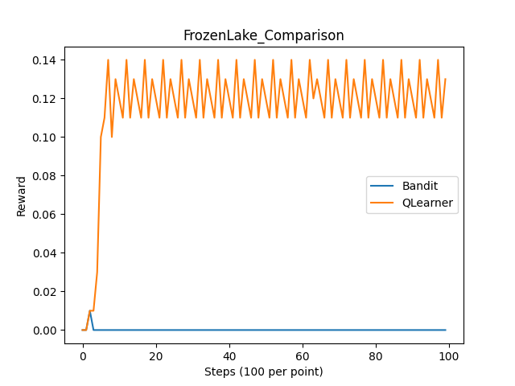
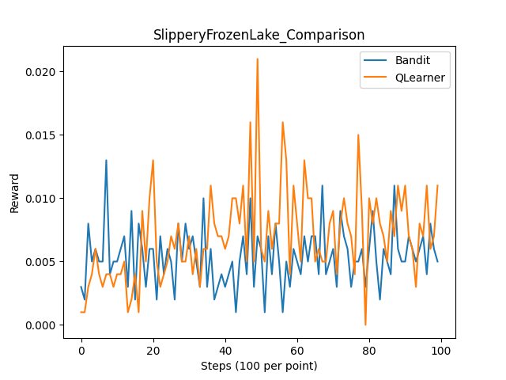
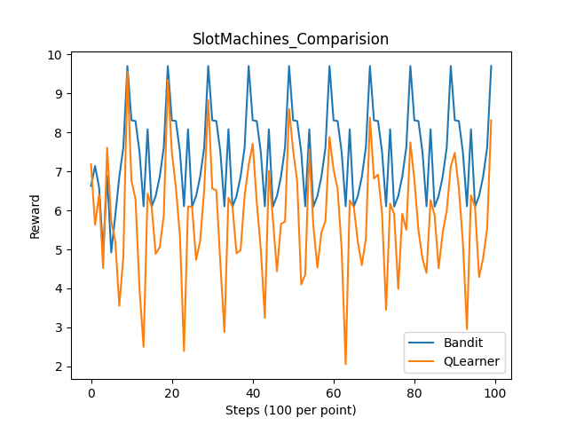

a.

In this plot we can see that Q Learner have a higher reward per step. Both algorithm reached the most optimal run before step 20. MAB got to that most optimal solution faster.

In this plot we can see on average Q learner received higher rewards. Q leaner reach the reward peak at around 50 steps. MAB on the other Stayed pretty consistent. This seem to imply that Q learner found the best solution where as MAB got stuck.

In this plot we can see that on average Bandit performed better than the Q learner.  Both algorithm followed the same type of trend but MAB consistantly get higher rewards while Q learner's reward hovers at a lower level.

b.

FrozenLake and slipperyFrozenLake are the two plot where Q learner appears to receive a higher average reward.

This can be explained by the fact that Q learning consider state transitions and are more suitable for complex environment. MAB assumes that the action of the agent does not impact the environment and subsequent reward, which makes it less suitable for a environment like Frozen lake.

c. 

Result can be improved in the FrozenLake environment for MAB if we adjust the epsilon value, which determines the exploration-exploitation tradeoff. We can decrease it to priorities short-term gain.

However, this still wouldn't make MAB as well as Q-learning because we cannot solve the fundamental lacking in handling reward change due to agent action.

d.

SlotMachine is the two plot where MAB appears to receive a higher average reward.

This can be explained by the "reveres" reason from question b. The SlotMachines environment allows more independence, which means that ne action to one machine will not impact other future actions. Similarly, the reward probabilities for for this environment stay constant over time. that Q learning consider state transitions and are more suitable for complex environment. Q learning on the other hand take too many consideration into account, which limits it's ability to focus on maximizing reward gains.

e. 

Result can be improve in the SlotMachine environment for Q learning if we adjust 
- raising the alpha value to allow bigger step size thus faster adaptation to maximize reward.
- lower the gamma value to zero to allow 100% focus on maximizing reward and pay no attention to consider future reward, since there is nothing to consider.
- allow the decay of the epsilon value, which mimics MAB to allow exploration more exploration.

However, this doesn't solve the fundamental problem where the q learning algorithm associate action with state, introduce unnecessary complexity that obstruct it perform at the same level as the MAB algorithm.